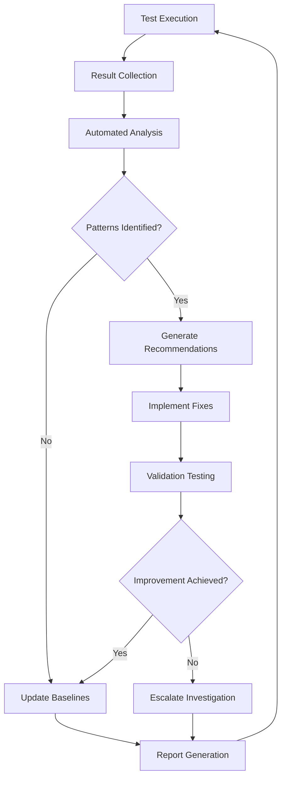

# I.O.R.A. Test Result Analysis

## Overview

This document provides guidelines and procedures for analyzing test results, identifying issues, and making data-driven decisions to improve the I.O.R.A. system quality and performance.

## Test Result Categories

### Success Metrics

#### 1. Test Execution Success
- **Pass Rate**: Percentage of tests that pass successfully
- **Target**: >99% pass rate for stable branches
- **Analysis**: Identify flaky tests and environmental issues

#### 2. Coverage Achievement
- **Line Coverage**: Percentage of code lines executed by tests
- **Branch Coverage**: Percentage of code branches executed
- **Target**: >85% line coverage, >80% branch coverage

#### 3. Performance Benchmarks
- **Execution Time**: Total time to run test suites
- **Target**: <10 minutes for full test suite
- **Memory Usage**: Peak memory consumption during testing

### Quality Metrics

#### 1. Code Quality Scores
```rust
// Clippy warnings analysis
struct CodeQualityMetrics {
    total_warnings: u32,
    error_warnings: u32,
    style_warnings: u32,
    performance_warnings: u32,
    complexity_warnings: u32,
}

impl CodeQualityMetrics {
    fn quality_score(&self) -> f64 {
        let base_score = 100.0;

        // Deduct points for different warning types
        let error_penalty = self.error_warnings as f64 * 10.0;
        let style_penalty = self.style_warnings as f64 * 1.0;
        let perf_penalty = self.performance_warnings as f64 * 2.0;
        let complexity_penalty = self.complexity_warnings as f64 * 3.0;

        (base_score - error_penalty - style_penalty - perf_penalty - complexity_penalty)
            .max(0.0)
            .min(100.0)
    }
}
```

#### 2. Test Effectiveness
- **Mutation Score**: Effectiveness at catching bugs
- **False Positive Rate**: Tests that fail incorrectly
- **Maintenance Cost**: Effort required to maintain tests

## Analysis Procedures

### 1. Daily Test Result Review

#### Automated Analysis Script
```bash
#!/bin/bash
# test_analysis.sh

echo "=== DAILY TEST ANALYSIS ==="

# Extract test results
echo "📊 Test Execution Summary:"
echo "Unit Tests: $(cargo test --lib --quiet 2>/dev/null && echo "✅ PASSED" || echo "❌ FAILED")"
echo "Integration Tests: $(cargo test --test integration_tests --quiet 2>/dev/null && echo "✅ PASSED" || echo "❌ FAILED")"
echo "Functional Tests: $(cargo test --test functional_quality_tests --quiet 2>/dev/null && echo "✅ PASSED" || echo "❌ FAILED")"

# Coverage analysis
echo ""
echo "📈 Coverage Analysis:"
COVERAGE=$(cargo tarpaulin --out Json --quiet 2>/dev/null | jq -r '.coverage_percentage // 0')
echo "Current Coverage: ${COVERAGE}%"
if (( $(echo "$COVERAGE < 85.0" | bc -l) )); then
    echo "⚠️  Coverage below target (85%)"
else
    echo "✅ Coverage meets target"
fi

# Performance analysis
echo ""
echo "⚡ Performance Analysis:"
EXEC_TIME=$(time cargo test --quiet 2>&1 | grep real | awk '{print $2}')
echo "Test Execution Time: $EXEC_TIME"

# Quality analysis
echo ""
echo "🔍 Code Quality Analysis:"
CLIPPY_OUTPUT=$(cargo clippy --quiet 2>&1)
WARNING_COUNT=$(echo "$CLIPPY_OUTPUT" | grep -c "warning:")
ERROR_COUNT=$(echo "$CLIPPY_OUTPUT" | grep -c "error:")

echo "Clippy Warnings: $WARNING_COUNT"
echo "Clippy Errors: $ERROR_COUNT"

if [ "$ERROR_COUNT" -gt 0 ]; then
    echo "❌ Code quality issues found"
elif [ "$WARNING_COUNT" -gt 10 ]; then
    echo "⚠️  High warning count ($WARNING_COUNT)"
else
    echo "✅ Code quality acceptable"
fi
```

#### Key Metrics Dashboard
```rust
// Daily metrics collection
struct DailyTestMetrics {
    date: DateTime<Utc>,
    test_pass_rate: f64,
    coverage_percentage: f64,
    execution_time_seconds: f64,
    clippy_warnings: u32,
    clippy_errors: u32,
    memory_usage_mb: f64,
    flaky_tests: Vec<String>,
}

impl DailyTestMetrics {
    fn generate_report(&self) -> String {
        format!(
            "# Daily Test Metrics Report - {}\n\
             \n\
             ## Test Health\n\
             - Pass Rate: {:.1}%\n\
             - Coverage: {:.1}%\n\
             - Execution Time: {:.1}s\n\
             - Memory Usage: {:.1}MB\n\
             \n\
             ## Code Quality\n\
             - Clippy Warnings: {}\n\
             - Clippy Errors: {}\n\
             - Flaky Tests: {}\n\
             \n\
             ## Recommendations\n\
             {}",
            self.date.format("%Y-%m-%d"),
            self.test_pass_rate,
            self.coverage_percentage,
            self.execution_time_seconds,
            self.memory_usage_mb,
            self.clippy_warnings,
            self.clippy_errors,
            self.flaky_tests.len(),
            self.generate_recommendations()
        )
    }

    fn generate_recommendations(&self) -> String {
        let mut recommendations = Vec::new();

        if self.test_pass_rate < 95.0 {
            recommendations.push("- Investigate low test pass rate (< 95%)".to_string());
        }

        if self.coverage_percentage < 85.0 {
            recommendations.push("- Increase test coverage (< 85%)".to_string());
        }

        if self.execution_time_seconds > 600.0 {
            recommendations.push("- Optimize test execution time (> 10 minutes)".to_string());
        }

        if self.clippy_errors > 0 {
            recommendations.push("- Fix Clippy errors".to_string());
        }

        if self.clippy_warnings > 20 {
            recommendations.push("- Address high warning count (> 20)".to_string());
        }

        if !self.flaky_tests.is_empty() {
            recommendations.push(format!("- Fix flaky tests: {}", self.flaky_tests.join(", ")));
        }

        if recommendations.is_empty() {
            "✅ All metrics within acceptable ranges".to_string()
        } else {
            recommendations.join("\n")
        }
    }
}
```

### 2. Test Failure Analysis

#### Failure Pattern Recognition
```rust
enum TestFailurePattern {
    Environmental,      // Network, database, external service issues
    RaceCondition,      // Async timing issues
    ResourceLeak,       // Memory, file handle leaks
    DataDependency,     // Test data corruption or inconsistency
    CodeRegression,     // Functionality broken by recent changes
    FlakyTest,          // Intermittent failures
    PerformanceIssue,   // Tests failing due to performance degradation
}

struct FailureAnalysis {
    pattern: TestFailurePattern,
    affected_tests: Vec<String>,
    root_cause: String,
    impact_assessment: String,
    recommended_actions: Vec<String>,
    prevention_measures: Vec<String>,
}

impl FailureAnalysis {
    fn analyze_failure(test_output: &str, test_name: &str) -> Self {
        // Pattern matching logic
        if test_output.contains("Connection refused") || test_output.contains("timeout") {
            Self::environmental_failure(test_name, test_output)
        } else if test_output.contains("race condition") || test_output.contains("data race") {
            Self::race_condition_failure(test_name, test_output)
        } else {
            Self::code_regression_failure(test_name, test_output)
        }
    }

    fn environmental_failure(test_name: &str, details: &str) -> Self {
        Self {
            pattern: TestFailurePattern::Environmental,
            affected_tests: vec![test_name.to_string()],
            root_cause: "External service or network connectivity issue".to_string(),
            impact_assessment: "Test environment instability affecting CI/CD reliability".to_string(),
            recommended_actions: vec![
                "Implement retry logic with exponential backoff".to_string(),
                "Use mock services for external dependencies".to_string(),
                "Improve test environment isolation".to_string(),
            ],
            prevention_measures: vec![
                "Regular monitoring of external service health".to_string(),
                "Implement circuit breaker patterns".to_string(),
                "Use service virtualization in test environments".to_string(),
            ],
        }
    }

    fn race_condition_failure(test_name: &str, details: &str) -> Self {
        Self {
            pattern: TestFailurePattern::RaceCondition,
            affected_tests: vec![test_name.to_string()],
            root_cause: "Concurrent access to shared resources without proper synchronization".to_string(),
            impact_assessment: "Unpredictable test behavior affecting CI/CD reliability".to_string(),
            recommended_actions: vec![
                "Implement proper synchronization primitives".to_string(),
                "Use atomic operations for shared state".to_string(),
                "Add timing buffers and retry logic".to_string(),
            ],
            prevention_measures: vec![
                "Code review focus on concurrent code patterns".to_string(),
                "Use static analysis tools for race condition detection".to_string(),
                "Implement comprehensive integration testing".to_string(),
            ],
        }
    }

    fn code_regression_failure(test_name: &str, details: &str) -> Self {
        Self {
            pattern: TestFailurePattern::CodeRegression,
            affected_tests: vec![test_name.to_string()],
            root_cause: "Recent code changes broke existing functionality".to_string(),
            impact_assessment: "Functionality regression affecting system stability".to_string(),
            recommended_actions: vec![
                "Review recent code changes for breaking modifications".to_string(),
                "Implement feature flags for gradual rollout".to_string(),
                "Enhance test coverage for affected code paths".to_string(),
            ],
            prevention_measures: vec![
                "Implement comprehensive regression test suites".to_string(),
                "Use automated code review tools".to_string(),
                "Implement gradual deployment strategies".to_string(),
            ],
        }
    }
}
```

#### Automated Failure Classification
```bash
#!/bin/bash
# classify_test_failures.sh

echo "=== TEST FAILURE ANALYSIS ==="

# Collect recent test failures
FAILED_TESTS=$(cargo test 2>&1 | grep -E "FAILED|ERROR" | head -10)

if [ -z "$FAILED_TESTS" ]; then
    echo "✅ No test failures detected"
    exit 0
fi

echo "📋 Recent Test Failures:"
echo "$FAILED_TESTS"
echo ""

# Classify failures
echo "🔍 Failure Classification:"

# Network-related failures
NETWORK_FAILURES=$(echo "$FAILED_TESTS" | grep -i -E "(connection|timeout|network|dns)" | wc -l)
if [ "$NETWORK_FAILURES" -gt 0 ]; then
    echo "🌐 Network Issues: $NETWORK_FAILURES failures"
    echo "   Recommendation: Check external service connectivity"
fi

# Race condition failures
RACE_FAILURES=$(echo "$FAILED_TESTS" | grep -i -E "(race|concurrent|deadlock)" | wc -l)
if [ "$RACE_FAILURES" -gt 0 ]; then
    echo "🔄 Race Conditions: $RACE_FAILURES failures"
    echo "   Recommendation: Review async code and synchronization"
fi

# Data-related failures
DATA_FAILURES=$(echo "$FAILED_TESTS" | grep -i -E "(data|parse|format|validation)" | wc -l)
if [ "$DATA_FAILURES" -gt 0 ]; then
    echo "📊 Data Issues: $DATA_FAILURES failures"
    echo "   Recommendation: Validate test data and fixtures"
fi

# Performance failures
PERF_FAILURES=$(echo "$FAILED_TESTS" | grep -i -E "(performance|timeout|slow)" | wc -l)
if [ "$PERF_FAILURES" -gt 0 ]; then
    echo "⚡ Performance Issues: $PERF_FAILURES failures"
    echo "   Recommendation: Review performance benchmarks and optimization"
fi

echo ""
echo "📈 Next Steps:"
echo "1. Review individual failure details"
echo "2. Implement recommended fixes"
echo "3. Add regression tests for fixed issues"
echo "4. Monitor for recurring patterns"
```

### 3. Coverage Gap Analysis

#### Automated Coverage Analysis
```rust
// Coverage gap identification
struct CoverageAnalysis {
    total_lines: u64,
    covered_lines: u64,
    coverage_percentage: f64,
    uncovered_files: Vec<UncoveredFile>,
    high_risk_uncovered: Vec<String>,
    coverage_trends: Vec<CoveragePoint>,
}

impl CoverageAnalysis {
    fn analyze_gaps(&self) -> Vec<CoverageRecommendation> {
        let mut recommendations = Vec::new();

        // Identify high-risk uncovered code
        for file in &self.uncovered_files {
            if self.is_high_risk_file(file) {
                recommendations.push(CoverageRecommendation {
                    file: file.name.clone(),
                    priority: RecommendationPriority::High,
                    reason: "High-risk functionality lacks test coverage".to_string(),
                    suggested_tests: self.suggest_tests_for_file(file),
                });
            }
        }

        // Analyze coverage trends
        if let Some(recent_trend) = self.coverage_trends.last() {
            if recent_trend.change_percentage < -1.0 {
                recommendations.push(CoverageRecommendation {
                    file: "Overall Coverage".to_string(),
                    priority: RecommendationPriority::Medium,
                    reason: format!("Coverage declining: {:.1}% over last period", recent_trend.change_percentage),
                    suggested_tests: vec!["Add tests for recently added features".to_string()],
                });
            }
        }

        recommendations
    }

    fn is_high_risk_file(&self, file: &UncoveredFile) -> bool {
        // Business-critical files
        file.name.contains("processor") ||
        file.name.contains("fetcher") ||
        file.name.contains("api") ||
        file.name.contains("blockchain") ||
        // Complex logic files
        file.complexity_score > 10 ||
        // Files with error handling
        file.error_handling_lines > 5
    }

    fn suggest_tests_for_file(&self, file: &UncoveredFile) -> Vec<String> {
        let mut suggestions = Vec::new();

        if file.name.contains("api") {
            suggestions.push("Add integration tests for API endpoints".to_string());
            suggestions.push("Test error response handling".to_string());
        }

        if file.name.contains("processor") {
            suggestions.push("Add unit tests for data processing logic".to_string());
            suggestions.push("Test edge cases and data validation".to_string());
        }

        if file.error_handling_lines > 0 {
            suggestions.push("Add tests for error conditions and recovery".to_string());
        }

        suggestions
    }
}
```

### 4. Performance Regression Analysis

#### Automated Performance Tracking
```rust
struct PerformanceRegressionAnalysis {
    baseline_metrics: HashMap<String, PerformanceMetric>,
    current_metrics: HashMap<String, PerformanceMetric>,
    regressions: Vec<PerformanceRegression>,
    improvements: Vec<PerformanceImprovement>,
    analysis_timestamp: DateTime<Utc>,
}

impl PerformanceRegressionAnalysis {
    fn analyze_regressions(&mut self) {
        for (metric_name, current) in &self.current_metrics {
            if let Some(baseline) = self.baseline_metrics.get(metric_name) {
                let degradation = ((current.value - baseline.value) / baseline.value) * 100.0;

                if degradation > 10.0 { // 10% degradation threshold
                    self.regressions.push(PerformanceRegression {
                        metric_name: metric_name.clone(),
                        baseline_value: baseline.value,
                        current_value: current.value,
                        degradation_percentage: degradation,
                        impact_assessment: self.assess_impact(metric_name, degradation),
                        recommended_actions: self.suggest_fixes(metric_name, degradation),
                    });
                } else if degradation < -5.0 { // 5% improvement
                    self.improvements.push(PerformanceImprovement {
                        metric_name: metric_name.clone(),
                        baseline_value: baseline.value,
                        current_value: current.value,
                        improvement_percentage: -degradation, // Make positive
                        significance: self.assess_significance(-degradation),
                    });
                }
            }
        }
    }

    fn assess_impact(&self, metric_name: &str, degradation: f64) -> String {
        match metric_name {
            "api_response_time" => {
                if degradation > 20.0 {
                    "Critical: API responses significantly slower, may impact user experience".to_string()
                } else {
                    "Moderate: API responses slower but within acceptable limits".to_string()
                }
            },
            "memory_usage" => {
                if degradation > 15.0 {
                    "High: Memory usage increased significantly, monitor for OOM issues".to_string()
                } else {
                    "Low: Memory usage increased moderately".to_string()
                }
            },
            "cpu_usage" => {
                if degradation > 25.0 {
                    "Critical: CPU usage spike may indicate performance bottleneck".to_string()
                } else {
                    "Moderate: CPU usage increased but manageable".to_string()
                }
            },
            _ => format!("Performance degradation of {:.1}% detected", degradation),
        }
    }

    fn suggest_fixes(&self, metric_name: &str, degradation: f64) -> Vec<String> {
        match metric_name {
            "api_response_time" => vec![
                "Profile API endpoints to identify bottlenecks".to_string(),
                "Optimize database queries and caching".to_string(),
                "Consider implementing response compression".to_string(),
            ],
            "memory_usage" => vec![
                "Check for memory leaks in recent changes".to_string(),
                "Optimize data structures and algorithms".to_string(),
                "Implement memory pooling where appropriate".to_string(),
            ],
            "cpu_usage" => vec![
                "Profile CPU-intensive operations".to_string(),
                "Optimize algorithms and data processing".to_string(),
                "Consider parallel processing improvements".to_string(),
            ],
            _ => vec![
                "Profile application performance".to_string(),
                "Review recent code changes".to_string(),
                "Optimize resource usage".to_string(),
            ],
        }
    }
}
```

## Reporting and Communication

### Test Result Dashboard
```rust
// Web dashboard for test results
struct TestDashboard {
    metrics: Arc<RwLock<DashboardMetrics>>,
    alerts: Arc<RwLock<Vec<DashboardAlert>>>,
    reports: Arc<RwLock<HashMap<String, TestReport>>>,
}

impl TestDashboard {
    async fn update_metrics(&self, new_metrics: DashboardMetrics) {
        *self.metrics.write().await = new_metrics;

        // Check for alert conditions
        self.check_alert_conditions().await;

        // Generate updated reports
        self.update_reports().await;
    }

    async fn check_alert_conditions(&self) {
        let metrics = self.metrics.read().await;

        let mut alerts = self.alerts.write().await;

        // Coverage alert
        if metrics.coverage_percentage < 85.0 {
            alerts.push(DashboardAlert {
                severity: AlertSeverity::High,
                title: "Coverage Below Threshold".to_string(),
                message: format!("Test coverage dropped to {:.1}%", metrics.coverage_percentage),
                timestamp: Utc::now(),
                acknowledged: false,
            });
        }

        // Performance alert
        if metrics.average_execution_time > 600.0 {
            alerts.push(DashboardAlert {
                severity: AlertSeverity::Medium,
                title: "Slow Test Execution".to_string(),
                message: format!("Test execution time exceeded 10 minutes: {:.1}s", metrics.average_execution_time),
                timestamp: Utc::now(),
                acknowledged: false,
            });
        }

        // Clean old alerts (keep last 50)
        if alerts.len() > 50 {
            alerts.drain(0..(alerts.len() - 50));
        }
    }

    async fn generate_html_report(&self) -> String {
        let metrics = self.metrics.read().await;
        let alerts = self.alerts.read().await;

        format!(
            r#"<!DOCTYPE html>
<html>
<head>
    <title>I.O.R.A. Test Dashboard</title>
    <style>
        body {{ font-family: Arial, sans-serif; margin: 20px; }}
        .metric {{ background: #f0f0f0; padding: 10px; margin: 10px 0; border-radius: 5px; }}
        .alert {{ border-left: 4px solid; padding: 10px; margin: 10px 0; }}
        .alert-high {{ border-left-color: #dc3545; background: #f8d7da; }}
        .alert-medium {{ border-left-color: #ffc107; background: #fff3cd; }}
        .status-good {{ color: #28a745; }}
        .status-warning {{ color: #ffc107; }}
        .status-error {{ color: #dc3545; }}
    </style>
</head>
<body>
    <h1>I.O.R.A. Test Dashboard</h1>
    <p>Last updated: {}</p>

    <div class="metric">
        <h3>Test Health Overview</h3>
        <p>Pass Rate: <span class="{}">{:.1}%</span></p>
        <p>Coverage: <span class="{}">{:.1}%</span></p>
        <p>Avg Execution Time: {:.1}s</p>
        <p>Total Tests: {}</p>
    </div>

    <h3>Active Alerts ({})</h3>
    {}
</body>
</html>"#,
            Utc::now().format("%Y-%m-%d %H:%M:%S UTC"),
            if metrics.pass_rate >= 95.0 { "status-good" } else { "status-error" },
            metrics.pass_rate,
            if metrics.coverage_percentage >= 85.0 { "status-good" } else if metrics.coverage_percentage >= 75.0 { "status-warning" } else { "status-error" },
            metrics.coverage_percentage,
            metrics.average_execution_time,
            metrics.total_tests,
            alerts.len(),
            alerts.iter().map(|alert| {
                let severity_class = match alert.severity {
                    AlertSeverity::High => "alert-high",
                    AlertSeverity::Medium => "alert-medium",
                    _ => "alert-low",
                };
                format!(r#"<div class="alert {}"><h4>{}</h4><p>{}</p><small>{}</small></div>"#,
                    severity_class, alert.title, alert.message,
                    alert.timestamp.format("%Y-%m-%d %H:%M:%S UTC"))
            }).collect::<Vec<_>>().join("\n")
        )
    }
}
```

### Trend Analysis and Forecasting

#### Automated Trend Detection
```rust
struct TrendAnalyzer {
    historical_data: Vec<TimeSeriesPoint>,
    analysis_window_days: i64,
    forecast_days: i64,
}

impl TrendAnalyzer {
    fn analyze_trends(&self) -> TrendAnalysisResult {
        let recent_data: Vec<_> = self.historical_data.iter()
            .filter(|point| point.timestamp > Utc::now() - Duration::days(self.analysis_window_days))
            .collect();

        let trend = self.calculate_linear_trend(&recent_data);
        let forecast = self.generate_forecast(&trend, self.forecast_days);
        let seasonality = self.detect_seasonality(&recent_data);

        TrendAnalysisResult {
            trend_slope: trend.slope,
            trend_intercept: trend.intercept,
            r_squared: trend.r_squared,
            forecast_values: forecast,
            seasonality_detected: seasonality.is_some(),
            confidence_level: self.calculate_confidence(&recent_data, &trend),
            recommendations: self.generate_trend_recommendations(&trend, &forecast),
        }
    }

    fn generate_trend_recommendations(&self, trend: &LinearTrend, forecast: &[ForecastPoint]) -> Vec<String> {
        let mut recommendations = Vec::new();

        // Declining trend
        if trend.slope < -0.1 {
            recommendations.push("Performance is declining - investigate root causes".to_string());
            recommendations.push("Consider performance optimization measures".to_string());
        }

        // Forecasted issues
        for forecast_point in forecast {
            if forecast_point.value > self.performance_threshold * 1.2 {
                recommendations.push(format!(
                    "Forecasted performance degradation on {} - plan mitigation",
                    forecast_point.timestamp.format("%Y-%m-%d")
                ));
            }
        }

        recommendations
    }
}
```

## Continuous Improvement Process

### Automated Feedback Loop

1. **Collect Metrics**: Gather test results, coverage data, performance metrics
2. **Analyze Trends**: Identify patterns and anomalies
3. **Generate Insights**: Create actionable recommendations
4. **Implement Fixes**: Apply identified improvements
5. **Validate Changes**: Confirm improvements through re-testing
6. **Update Baselines**: Adjust expectations based on improvements

### Quality Improvement Workflow



### Success Metrics Tracking

```rust
struct QualityImprovementMetrics {
    baseline_date: DateTime<Utc>,
    initial_metrics: QualityMetrics,
    current_metrics: QualityMetrics,
    improvements_achieved: Vec<Improvement>,
    ongoing_initiatives: Vec<Initiative>,
}

impl QualityImprovementMetrics {
    fn calculate_improvement_rate(&self) -> f64 {
        let time_elapsed_days = (Utc::now() - self.baseline_date).num_days() as f64;

        if time_elapsed_days < 1.0 {
            return 0.0;
        }

        let total_improvements: f64 = self.improvements_achieved.iter()
            .map(|imp| imp.impact_score)
            .sum();

        total_improvements / time_elapsed_days
    }

    fn generate_progress_report(&self) -> String {
        format!(
            "# Quality Improvement Progress Report\n\
             \n\
             **Period:** {} days\n\
             **Improvements Achieved:** {}\n\
             **Improvement Rate:** {:.2} per day\n\
             **Active Initiatives:** {}\n\
             \n\
             ## Key Improvements\n\
             {}\n\
             \n\
             ## Ongoing Work\n\
             {}",
            (Utc::now() - self.baseline_date).num_days(),
            self.improvements_achieved.len(),
            self.calculate_improvement_rate(),
            self.ongoing_initiatives.len(),
            self.improvements_achieved.iter()
                .map(|imp| format!("- **{}**: {} (+{:.1} impact)", imp.title, imp.description, imp.impact_score))
                .collect::<Vec<_>>()
                .join("\n"),
            self.ongoing_initiatives.iter()
                .map(|init| format!("- **{}**: {} ({}%)", init.title, init.description, init.progress_percentage))
                .collect::<Vec<_>>()
                .join("\n")
        )
    }
}
```

This comprehensive test result analysis framework ensures data-driven decision making and continuous quality improvement for the I.O.R.A. system.
